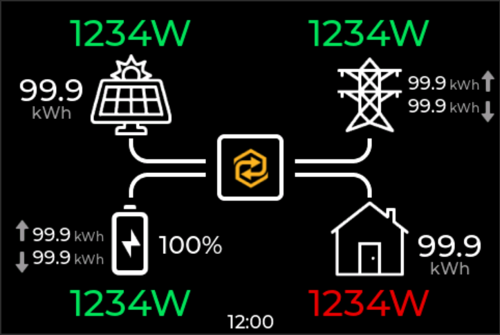
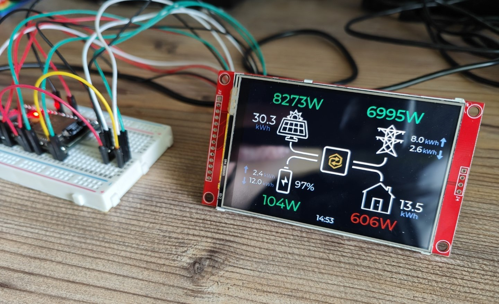
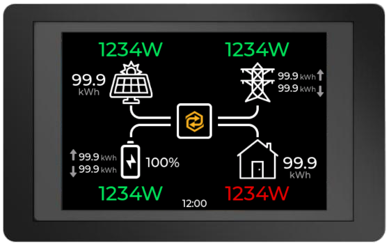

# Sunsynk IHD 35
An in-home display (IHD) for a Sunsynk hybrid inverter, using an ESP32 SoC and a 3.5" 480x320 TFT touchscreen.

The IHD uses the Sunsynk API to retrieve near real-time data so no additional hardware or software integrations needed - if the inverter is reporting data to Sunsynk, and the Sunsynk app or website are showing it, the IHD will be able to display it.

 IHD Home Screen

## Prototype
My prototype hardware is an ESP-WROOM-32 'Dev Kit C' board and a cheap 3.5" TFT touch sceen with an ILI9488 display driver.  Both can be bought on Amazon.

* ESP32 Dev Kit C - https://www.amazon.co.uk/dp/B0BP1QWVMB/
* 3.5" Touch screen - https://www.amazon.co.uk/dp/B09DGPYNKY

 ESP32 and 3.5" TFT LCD

 IHD on 3.5" TFT LCD

## Future Hardware
I've ordered a couple of different ESP32 display devices from [elecrow.com](https://www.elecrow.com/)
* [3.5" ESP32 480x320 TFT with ILI9488](https://www.elecrow.com/esp-terminal-with-esp32-3-5-inch-parallel-480x320-tft-capacitive-touch-display-rgb-by-chip-ili9488.html)
*  [7" ESP32 800x480 RGB TFT](https://www.elecrow.com/esp32-display-7-inch-hmi-display-rgb-tft-lcd-touch-screen-support-lvgl.html)

Both look like nice devices which would fit easily anywhere you might like your Sunsynk IHD.  They use slightly different hardware, which will require integrating different libraries, so I will likely have to adapt the project for them when they eventually arrive.

 3.5" IHD Mockup

The larger interface of the 7" screen will allow displaying more data in additional screens.

## How it works
It's pretty simple. 

The ESP32 is configured to connect to the local Wi-Fi network, and is programmed with login details for the Sunsynk app or portal and the IDs of the plant and inverter for which data should be displayed.

Every 30s, the IHD polls the Sunsynk API for PV, grid, battery, and load data.  This data is then rendered on the interface.

Green means generating, exporting, or charging. Red means consuming, importing, or discharging.

The display also shows daily totals for generation, import, export, charge, discharge, and load.

## Building / Developing
Anyone with a small amount of experience with Arduino development and ESP32 hardware should be able to build the code fairly easily by cloning this repository.

At a high level:
1. Clone the repository
1. Open `SunsynkIHD35.ino` in the Arduino IDE
1. Copy `Config_Example.h` to `Config.h` and update with your own settings
1. Install the necessary libraries in your IDE
1. Configure `TFT_eSPI` and `lvgl` according to their instructions (sample configuration files are included in the repository)
1. Compile and upload

In the fullness of time I will add more information to make it easier. I plan to to do that after I receive the new display hardware and have figured out what a 'final' version will look like.

## Disclaimer
I have no association or affiliation with Sunsynk, I'm just a system owner who likes to tinker. I offer this to the community with no warranty whatsoever.