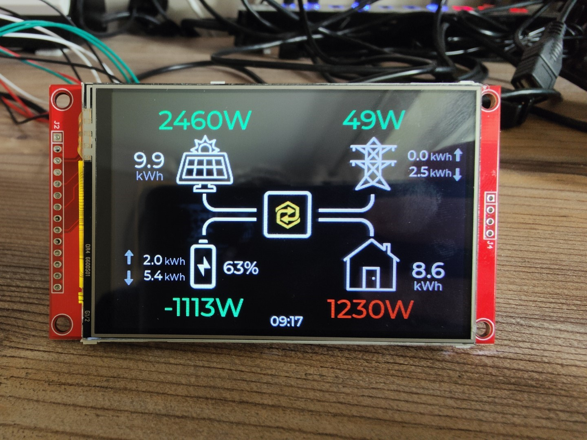

# Sunsynk IHD 35
An in-home display (IHD) for a Sunsynk hybrid inverter, using an ESP32-S3 SoC and a 3.5" 480x320 TFT touchscreen.

The IHD uses the Sunsynk API to retrieve near real-time data so no additional hardware or software integrations needed - if the inverter is reporting data to Sunsynk, and the Sunsynk app or website are showing it, the IHD will be able to display it. The icons are by [Icons8](https://icons8.com).

 <i>IHD Home Screen</i>

## Prototype
My initial prototype hardware was an ESP-WROOM-32 'Dev Kit C' board and a cheap 3.5" TFT touch sceen with an ILI9488 display driver.

The ESP32 was not up to the job of dealing with the API and has now been replaced by an ESP32-S3 DevKitC-1. I have the N16R8 (16MB flash, 8MB PSRAM), which works well, but any ESP32-S3 module with PSRAM should be OK. 

The hardware can be bought fairly cheaply on Amazon or eBay.

* ESP32-S3 DevKitC-1 N8R8 - [eBay](https://www.ebay.co.uk/itm/385416414047)
* 3.5" Touch screen - [Amazon](https://www.amazon.co.uk/dp/B09DGPYNKY) [eBay](https://www.ebay.co.uk/itm/275425726917?var=576023708472)

 <i>ESP32 and 3.5" TFT LCD</i>

 <i>IHD on 3.5" TFT LCD</i>

### Board Wiring

You can wire the the TFT to any pins you like (and change the pins in the config file accordingly), or you can use the same wiring I used to.

For the ESP32, I used the `Setup204_ESP32_TouchDown.h` template from the TFT_eSPI library with one change - I moved `TFT_DC` from `GPIO 2` to `GPIO 0` to prevent the built-in LED (which is on GPIO2) being constantly on.

 <i>ESP32 and 3.5" TFT LCD Wiring</i>

For the ESP32-S3 I used the following wiring:

| LCD Pin | ESP32S3 GPIO |
| - | - |
| DC/RS | GPIO6 |
| CS | GPIO10 |
| SCK | GPIO12 |
| SDI (MOSI) | GPIO11 |
| SDO (MISO)| N/C |
| LED | GPIO7 |
| RST | GPIO5 |
| T_CLK | GPIO12 |
| T_DO | GPIO13 |
| T_DIN | GPIO11 |
| T_CS | GPIO15 |
| T_IRQ | GPIO16 (but disabled in pin assignments)| 

This wiring has the advantage of being compatible with this ESP32-S3 / TFT combiner PCB, which could be used to create a compact DIY build.
https://www.pcbway.com/project/shareproject/ESP32_S3_TFT_Combiner_V1_92bd8d61.html

## Off the Shelf Hardware
I've ordered several different ESP32 display devices from [elecrow.com](https://www.elecrow.com/)
* [3.5" ESP32 480x320 TFT with ILI9488](https://www.elecrow.com/esp-terminal-with-esp32-3-5-inch-parallel-480x320-tft-capacitive-touch-display-rgb-by-chip-ili9488.html)
* [5" ESP32 800x480 RGB TFT](https://www.elecrow.com/esp32-display-5-inch-hmi-display-rgb-tft-lcd-touch-screen-support-lvgl.html)
* [7" ESP32 800x480 RGB TFT](https://www.elecrow.com/esp32-display-7-inch-hmi-display-rgb-tft-lcd-touch-screen-support-lvgl.html)

All three display devices have an ESP32-S3 with 8MB of PSRAM.

The 3.5" display is very nice - bright, sharp and easy to look at. The 7" display is somewhat disappointing as it has a very narrow viewing angle and looks washed out at most angles. It does display everything at a good size though so I'll keep playing with it. I don't have the 5" display yet.

 <i>3.5" IHD Mockup</i>

The 3.5" package looks like a nice compact device which can display all the salient information. The larger interface of the %" 7" screen will allow displaying more data in additional screens.

## How it works
It's pretty simple. 

The ESP32 is configured to connect to the local Wi-Fi network, and is programmed with login details for the Sunsynk app or portal and the IDs of the plant and inverter for which data should be displayed.

Every 30s, the IHD polls the Sunsynk API for PV, grid, battery, and load data. This data is then rendered on the interface.

Green means generating, exporting, or charging. Red means consuming, importing, or discharging.

The display also shows daily totals for generation, import, export, charge, discharge, and load.

The display will automatically switch off (or dim) at night.

## Building / Developing
Anyone with a small amount of experience with Arduino development and ESP32 hardware should be able to build the code fairly easily by cloning this repository.

Due to limitations of the Arduino IDE the project needs to be compiled using PlatformIO.

At a high level:
1. Clone the repository
1. Open the source folder in your PlatformIO IDE (Visual Studio Code with the PlatformIO extension is highly recommended)
1. Copy `Config_Example.h` to `Config.h` and update with your own settings
1. Select the appropriate display using one of the predefined boards
1. Build and upload

In the fullness of time I will add more information to make it easier.

## Disclaimer
I have no association or affiliation with Sunsynk, I'm just a system owner who likes to tinker.

This is very much a work in progress, and the code should be considered pre-beta. I'm quite sure that it can be significantly improved, and over time it will be.

I offer this project to the community with no warranty whatsoever.
